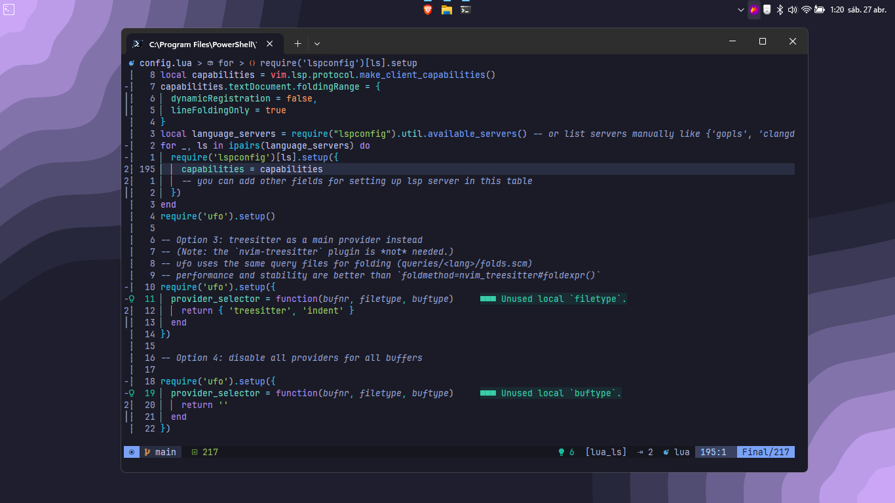

# Dotfiles for Lunarvim config.

Este repositorio contiene un archivo de configuración para LVIM, mi editor de código preferido. Aunque admito que la estructura puede parecer un poco desordenada, te aseguro que funciona de manera efectiva.

## Contenido del Repositorio

- **plugins.vim**: Aquí encontrarás la lista de los plugins utilizados, así como su configuración asociada.
- **keybindings.vim**: Contiene las combinaciones de teclas personalizadas que he definido para mejorar mi flujo de trabajo.
- 

## Notas de Uso
- sigue las instruccion de instalacion de Lunarvim
  [ repositorio Lunarvim ](https://github.com/LunarVim/LunarVim.git)
- copia el contenido de el directorio de configuraciones lunarvim
  
Si decides utilizar esta configuración, ten en cuenta lo siguiente:

- **Compatibilidad**: Esta configuración ha sido probada en mi entorno personal y puede requerir ajustes adicionales para adaptarse a tus necesidades.
- **Mantenimiento**: Estoy comprometido a mantener este repositorio actualizado y mejorar la organización con el tiempo.
- **Feedback**: Si tienes sugerencias para mejorar la configuración o encuentras algún problema, no dudes en abrir un issue o enviar un pull request.

## Contribuciones

¡Las contribuciones son bienvenidas! Si tienes ideas para mejorar esta configuración o deseas compartir tus propias personalizaciones, ¡no dudes en colaborar!

## Contacto

Si tienes alguna pregunta o simplemente quieres charlar sobre LVIM u otras herramientas de desarrollo, no dudes en contactarme.

